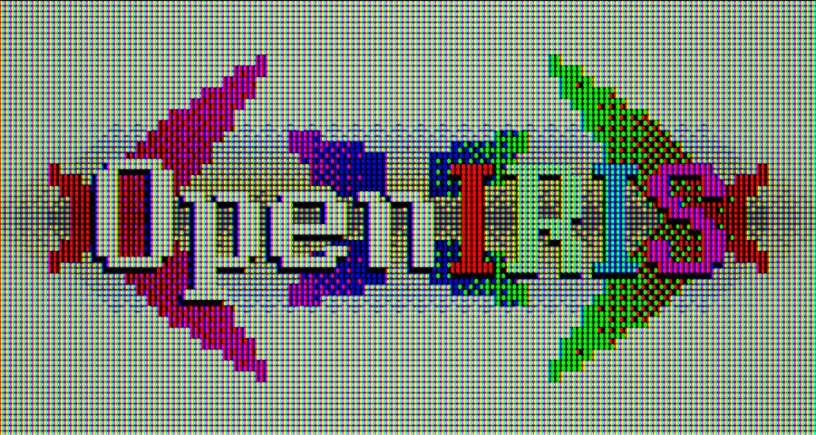

<h1>OpenIRIS</h1>
<h2>An open source Programming Language & Compiler.</h2>

### • Why OpenIRIS?
OpenIRIS uses a clean, human-readable C-like syntax to help programmers, especially beginners, learn programming concepts more naturally.
It combines traditional C-style operators like & and * with explicit keywords like addressof:: and depoint::, making the code more self-explanatory.

### • Progressive Learning
Introduces advanced programming concepts gradually, reducing the learning curve for beginners. It also focuses on minimizing common C programming mistakes by providing clearer syntax and feedback.

### • Seamless Transition to C
OpenIRIS can generate equivalent C code, making it easy to move from OpenIRIS to traditional C/C++ programming.